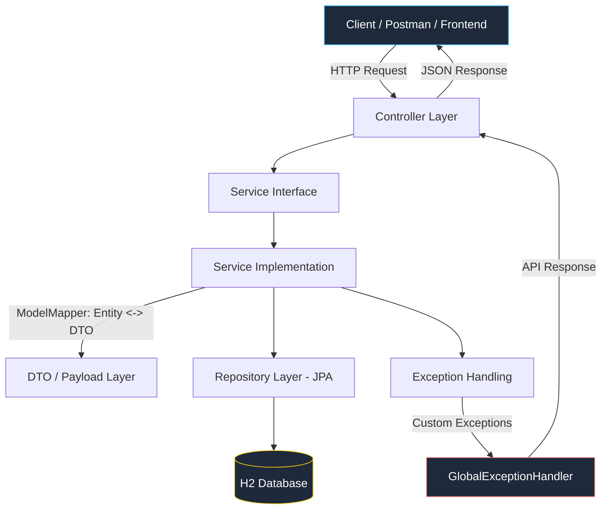
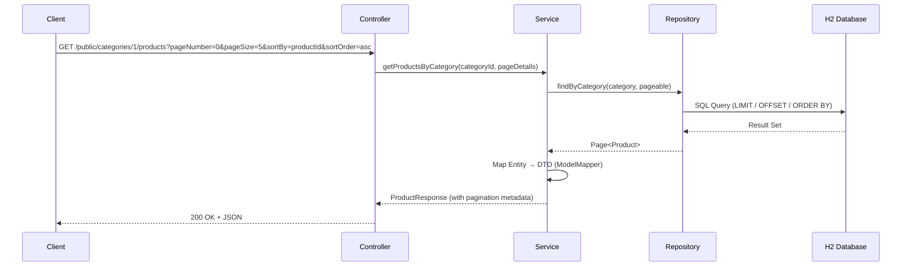
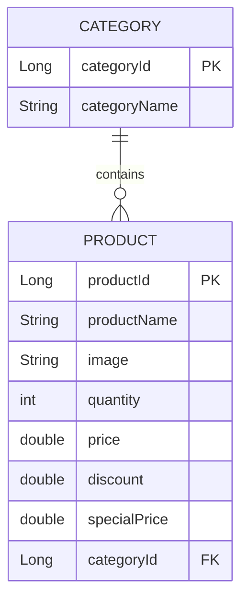

<div align="center">

# 🛒 E-Commerce — Spring Boot Learning Project


> A hands-on e-commerce backend built while learning **Spring** and **Spring Boot** from the ground up — every concept learned is immediately implemented here, turning theory into a real, structured, production-style project.

</div>

---

<div align="center">

## 📌 Overview

</div>

This is a **layered, RESTful e-commerce backend** built to reinforce core Spring Boot concepts through practical implementation. Instead of isolated tutorials, every feature — exception handling, pagination, DTO mapping, image uploads — is built directly into a working application with a clean package structure and consistent API design.

**7 days in**, the project already covers full CRUD for **Categories** and **Products**, complete with search, filtering, sorting, pagination, and image handling — with **Spring Security** as the next milestone.

---

<div align="center">

## 🧰 Tech Stack

</div>

<div align="center">

| Layer | Technology |
|---|---|
| Language | Java 25 |
| Framework | Spring Boot 4.1.0 |
| Web | Spring Web MVC |
| Persistence | Spring Data JPA + Hibernate |
| Database | H2 (in-memory, with H2 Console) |
| Object Mapping | ModelMapper 3.2.6 |
| Boilerplate Reduction | Lombok |
| Validation | Spring Boot Starter Validation |
| Testing | Spring Boot Starter Test |
| Build Tool | Maven |

</div>

<div align="center">

### Dependencies Used

</div>

<div align="center">

`spring-boot-starter-webmvc` • `spring-boot-starter-webmvc-test` • `spring-boot-h2console` • `spring-boot-starter-data-jpa` • `lombok` • `spring-boot-starter-validation` • `modelmapper`

</div>

---

<div align="center">

## 🏗️ Architecture

</div>

The project follows a clean **layered architecture**, separating concerns across Controller → Service → Repository → Database, with DTOs decoupling the API contract from internal entities.



<div align="center">

### Package Structure

</div>

```
com.sougata.ecommerce.project
├── config              → AppConfig, AppConstants
├── controller           → CategoryController, ProductController
├── exceptions            → APIException, ResourceNotFoundException, GlobalExceptionHandler
├── model                → Category, Product
├── payload              → DTOs & Response wrappers (APIResponse, CategoryDTO, ProductDTO, etc.)
├── repositories          → CategoryRepository, ProductRepository
└── service              → CategoryService, ProductService, FileService (+ Implementations)
```

---

<div align="center">

## 🔄 Request Lifecycle (Example: Paginated Product Search)

</div>



---

<div align="center">

## 🗃️ Data Model

</div>



---

<div align="center">

## ✨ Features Implemented So Far

</div>

- ✅ Full CRUD REST APIs for **Category** and **Product**
- ✅ Custom exception handling (`APIException`, `ResourceNotFoundException`, `GlobalExceptionHandler`)
- ✅ Pagination & Sorting (`pageNumber`, `pageSize`, `sortBy`, `sortOrder`)
- ✅ Search by **keyword**, **category**, and **ID**
- ✅ DTO-based clean API contracts using **ModelMapper**
- ✅ Product **image upload** & update via `FileService`
- ✅ **API Versioning** (`/api/v1/...`)
- ✅ Layered OOP-driven design (interfaces + implementations)
- ✅ JPA / Hibernate ORM with H2 in-memory database
- ✅ 40+ structured, incremental GitHub commits

---

<div align="center">

## 🔌 API Endpoints

</div>

<div align="center">

### Category APIs

</div>

<div align="center">

| Method | Endpoint | Description |
|---|---|---|
| `GET` | `/api/v1/public/categories` | Get all categories |
| `POST` | `/api/v1/public/categories` | Create a new category |
| `PUT` | `/api/v1/public/categories/{categoryId}` | Update a category |
| `DELETE` | `/api/v1/admin/categories/{categoryId}` | Delete a category |

</div>


<div align="center">

### Product APIs

</div>

<div align="center">
  
| Method | Endpoint | Description |
|---|---|---|
| `GET` | `/api/v1/public/products` | Get all products |
| `GET` | `/api/v1/public/categories/{categoryId}/products` | Get products by category |
| `GET` | `/api/v1/public/products/keyword/{keyword}` | Search products by keyword |
| `POST` | `/api/v1/admin/categories/{categoryId}/product` | Add a product to a category |
| `PUT` | `/api/v1/admin/product/{productId}` | Update a product |
| `PUT` | `/api/v1/products/{productId}/image` | Update product image |
| `DELETE` | `/api/v1/admin/products/{productId}` | Delete a product |

</div>

<div align="center">

### Query Parameters (Pagination & Sorting)

</div>

```
?pageNumber=0&pageSize=5&sortBy=productId&sortOrder=asc
```

Example:
```
GET /api/v1/public/categories/1/products?pageNumber=0&pageSize=5&sortBy=productId&sortOrder=asc
```

---

<div align="center">

## 🚀 Getting Started

</div>

```bash
# Clone the repository
git clone https://github.com/<your-username>/<repo-name>.git
cd <repo-name>

# Run the application
./mvnw spring-boot:run
```

The app runs on `http://localhost:8080` by default.

**H2 Console:** `http://localhost:8080/h2-console`

---

<div align="center">

## 🗺️ Roadmap

</div>

<div align="center">

| Status | Milestone |
|---|---|
| ✅ | Category & Product CRUD APIs |
| ✅ | Exception handling & validation |
| ✅ | Pagination, sorting & search |
| ✅ | Image upload |
| ✅ | API versioning |
| 🔜 | Spring Security (Authentication & Authorization) |
| 🔜 | JWT-based stateless auth |
| 🔜 | Cart & Order management |
| 🔜 | Payment integration |
| 🔜 | Unit & Integration testing |
| 🔜 | Deploying on AWS |

</div>

---

<div align="center">

## 👨‍💻 About This Project

</div>

Built as part of a **7-day intensive Spring Boot learning sprint** — the goal isn't just to follow tutorials, but to *build while learning*, turning every new concept (OOP principles, exception design, JPA relationships, DTO patterns) into working, committed code.

---

<div align="center">

## 📄 License

</div>

<div align="center">

This project is for learning purposes and open for feedback, suggestions, and contributions.

</div>
