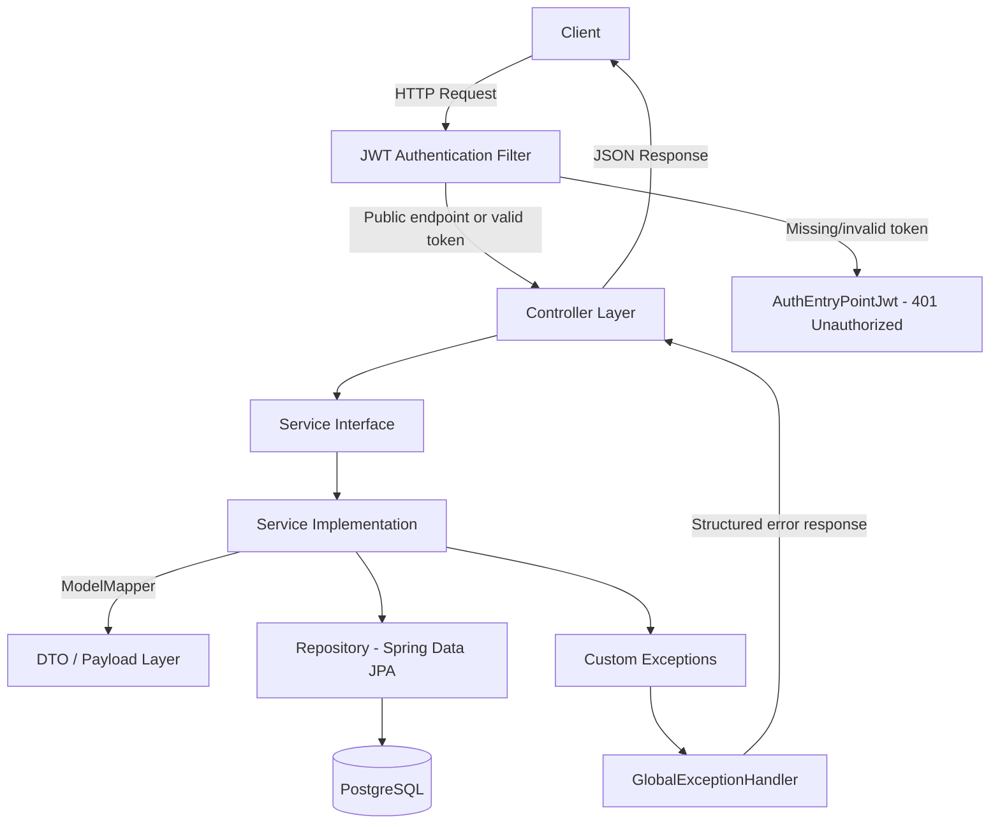
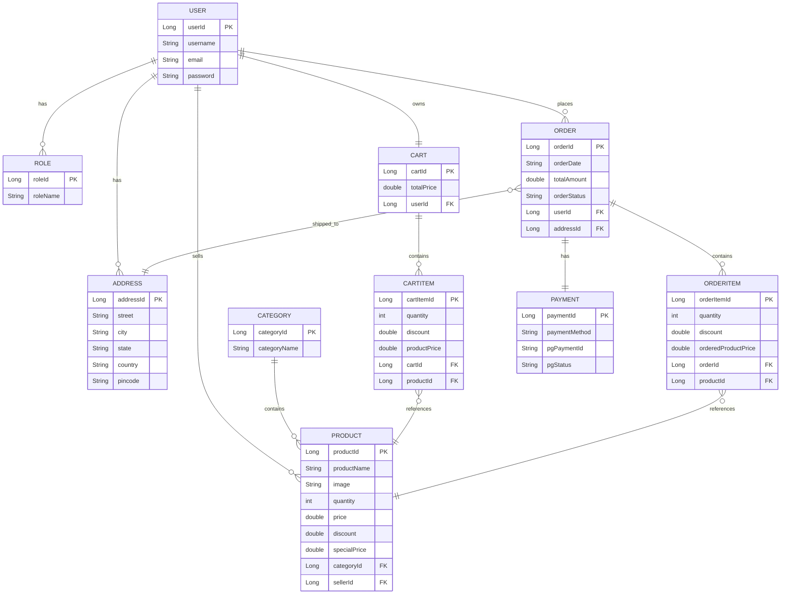
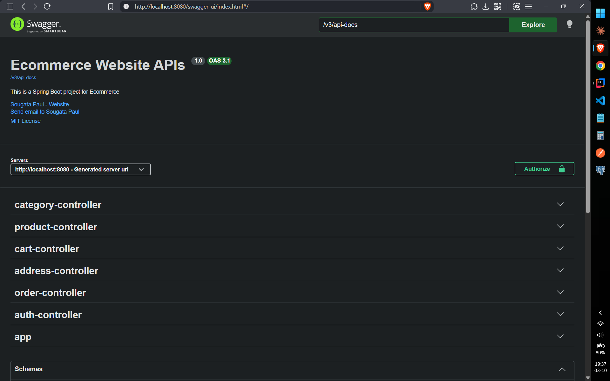
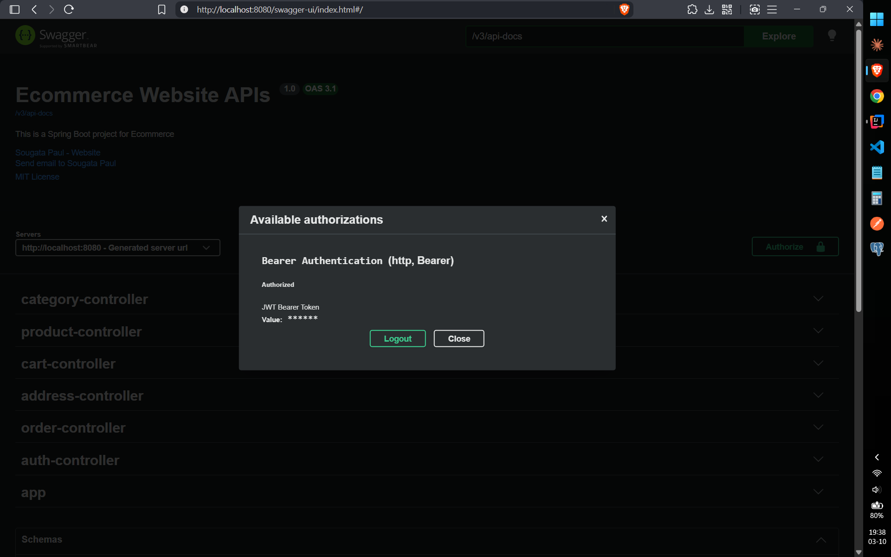
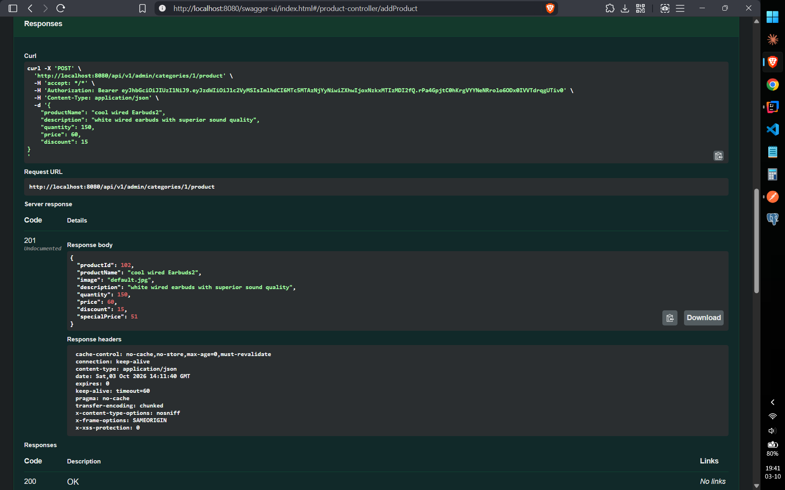
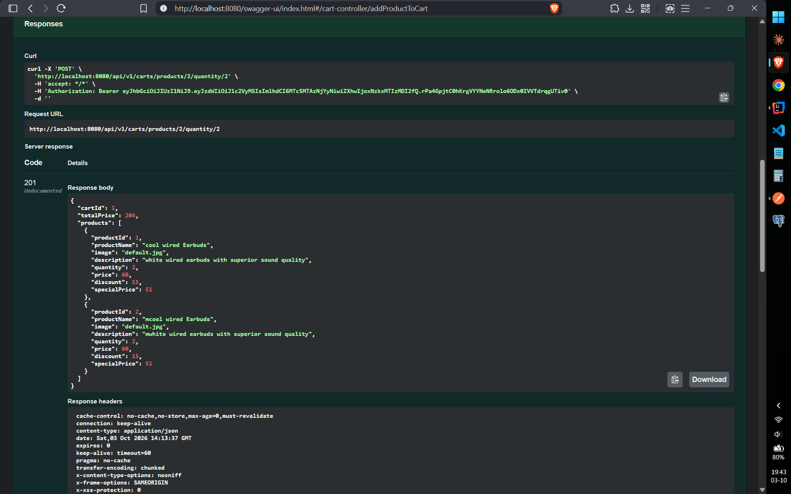
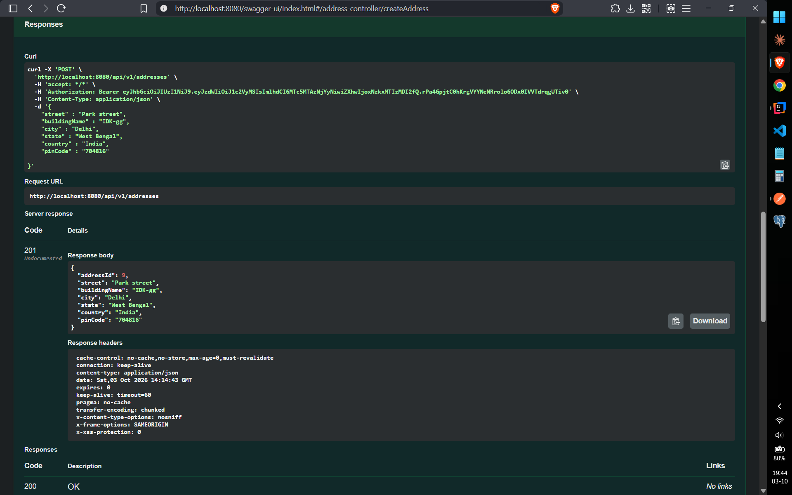
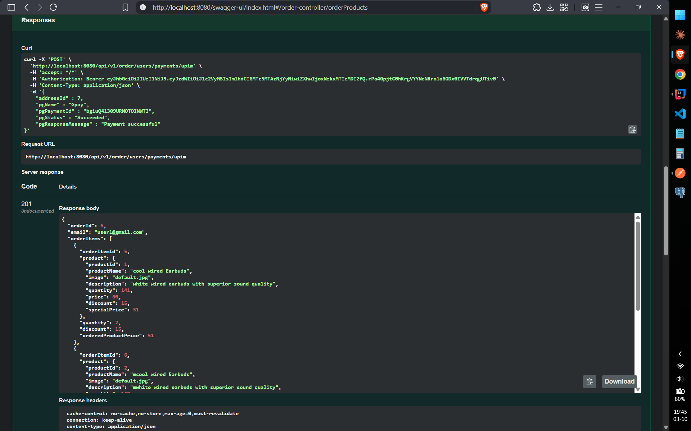

# Spring Boot E-Commerce Backend

[](https://openjdk.org/)
[](https://spring.io/projects/spring-boot)
[](https://www.postgresql.org/)
[](https://jwt.io/)
[]()

A layered, RESTful e-commerce backend built with Spring Boot, developed as a hands-on learning project and evolved incrementally over 100+ structured commits. The project implements stateless JWT authentication, role-based authorization, catalog management, cart and inventory logic, address management, and a transactional order placement workflow, backed by PostgreSQL.

This README documents the current, actually-implemented state of the project. Planned work (Docker, AWS deployment, external payment gateway integration) is explicitly marked as planned and not represented as complete.

---

## Table of Contents

1. [Overview](#overview)
2. [Tech Stack](#tech-stack)
3. [Architecture](#architecture)
4. [Package Structure](#package-structure)
5. [Authentication & Security](#authentication--security)
6. [Category & Product Management](#category--product-management)
7. [DTO Architecture](#dto-architecture)
8. [Validation & Exception Handling](#validation--exception-handling)
9. [Cart Management](#cart-management)
10. [Address Management](#address-management)
11. [Order Placement](#order-placement)
12. [Database](#database)
13. [API Documentation (Swagger/OpenAPI)](#api-documentation-swaggeropenapi)
14. [Monitoring (Actuator)](#monitoring-actuator)
15. [Testing](#testing)
16. [API Reference](#api-reference)
17. [Configuration & Local Setup](#configuration--local-setup)
18. [Deployment Roadmap](#deployment-roadmap)
19. [Engineering Challenges](#engineering-challenges)
20. [Key Design Decisions](#key-design-decisions)
21. [Development Journey](#development-journey)
22. [Engineering Highlights](#engineering-highlights)
23. [Screenshots](#screenshots)

---

## Overview

This project started as a simple Category/Product CRUD application and was built up incrementally into a more complete backend as new Spring concepts were learned and applied directly to the codebase:

- Core REST APIs with layered architecture
- JPA/Hibernate persistence
- DTO-based API contracts with validation
- Centralized exception handling
- Pagination, dynamic sorting, and keyword search
- Product image upload
- API versioning
- Spring Security with stateless JWT authentication
- Role-based authorization
- Address and cart management
- Transactional order placement with payment record handling
- Migration to PostgreSQL
- API documentation via Swagger/OpenAPI (including JWT-protected endpoint testing)
- Application monitoring via Spring Boot Actuator

Docker and AWS deployment are the next planned phase and are **not yet implemented** (see [Deployment Roadmap](#deployment-roadmap)).

---

## Tech Stack

| Category | Technology |
|---|---|
| Language | Java 25 |
| Framework | Spring Boot 4.1.0 |
| Web | Spring Web MVC |
| Security | Spring Security, JWT (JJWT) |
| Persistence | Spring Data JPA, Hibernate |
| Database | PostgreSQL |
| Object Mapping | ModelMapper 3.2.6 |
| Validation | Jakarta/Spring Validation |
| API Documentation | SpringDoc OpenAPI (Swagger UI) |
| Monitoring | Spring Boot Actuator |
| Boilerplate Reduction | Lombok |
| Testing | Spring Boot Test, Spring Security Test |
| Build Tool | Maven |

### Key Dependencies

`spring-boot-starter-web` · `spring-boot-starter-data-jpa` · `spring-boot-starter-security` · `spring-boot-starter-validation` · `spring-boot-starter-actuator` · `spring-boot-starter-test` · `spring-security-test` · `postgresql` · `modelmapper` · `lombok` · `jjwt-api` · `jjwt-impl` · `jjwt-jackson` · `springdoc-openapi-starter-webmvc-ui`

---

## Architecture

The project follows a standard layered architecture. Incoming requests pass through a JWT authentication filter before reaching the controller layer, and controllers delegate to service interfaces, which are backed by service implementations that handle business logic and delegate persistence to Spring Data JPA repositories.


```mermaid
graph TD
    Client[Client] -->|HTTP Request| Filter[JWT Authentication Filter]
    Filter -->|Public endpoint or valid token| Controller[Controller Layer]
    Filter -->|Missing/invalid token| EntryPoint[AuthEntryPointJwt - 401 Unauthorized]
    Controller --> SvcI[Service Interface]
    SvcI --> SvcImpl[Service Implementation]
    SvcImpl -->|ModelMapper| DTO[DTO / Payload Layer]
    SvcImpl --> Repo[Repository - Spring Data JPA]
    Repo --> DB[(PostgreSQL)]
    SvcImpl --> Exc[Custom Exceptions]
    Exc --> GEH[GlobalExceptionHandler]
    GEH -->|Structured error response| Controller
    Controller -->|JSON Response| Client
```

Request/response contracts are kept separate from persistence entities through a dedicated DTO layer (see [DTO Architecture](#dto-architecture)).

---

## Package Structure

```
com.sougata.ecommerce.project
├── EcommerceApplication
├── config               (AppConfig, AppConstants, SwaggerConfig)
├── controller           (Auth, Category, Product, Cart, Address, Order controllers)
├── exceptions           (APIException, ResourceNotFoundException, GlobalExceptionHandler)
├── model                (User, Role, Address, Category, Product, Cart, CartItem, Order, OrderItem, Payment)
├── payload              (DTOs and response wrappers)
├── repositories         (Spring Data JPA repositories per entity)
├── security
│   ├── WebSecurityConfig
│   ├── jwt              (AuthTokenFilter, JwtUtils, AuthEntryPointJwt, response models)
│   ├── request           (LoginRequest, SignupRequest)
│   └── service           (UserDetailsImplementation, UserDetailsServiceImplementation)
├── service              (Service interfaces and implementations)
├── utils                (AuthUtil)
└── resources
    ├── static
    ├── templates
    └── application.properties
```

---

## Authentication & Security

The project implements **stateless JWT authentication** using Spring Security rather than session-based authentication, which avoids server-side session state and scales more naturally across multiple backend instances.

Implemented components and concepts:

- User signup, signin, and signout
- JWT generation and validation (`JwtUtils`)
- Custom `AuthTokenFilter` that validates the JWT on each request and populates the `SecurityContext`
- `AuthEntryPointJwt` as a custom authentication entry point for unauthorized access
- `UserDetailsServiceImplementation` and `UserDetailsImplementation` backing Spring Security's `AuthenticationManager` / `DaoAuthenticationProvider`
- BCrypt password hashing
- Role-based authorization with `USER`, `SELLER`, and `ADMIN` roles
- A mix of public endpoints (`/api/v1/public/**`) and protected endpoints requiring authentication/authorization

### Externalized Secrets

JWT secrets and database credentials are read from environment variables rather than being committed to source control:

```properties
spring.app.jwtSecret=${JWT_SECRET}
spring.app.jwtExpirationMs=86400000
spring.datasource.password=${DB_SECRET}
```

This matters for a few reasons: committing secrets to a Git repository exposes them permanently in version history (even if later removed), environment-based configuration allows different secrets per environment (local, staging, production) without code changes, and it prevents credentials from being visible to anyone with read access to the repository, including on a public GitHub project like this one.

---

## Category & Product Management

**Category**
- Create, read, update, delete
- Pagination and sorting on list retrieval

**Product**
- Create, read, update, delete
- Search by keyword
- Retrieve by category
- Retrieve by ID
- Pagination and dynamic sorting
- Image upload and update
- Discount and special price fields
- Quantity (inventory) tracking

All endpoints are versioned under `/api/v1/...` to allow future API evolution without breaking existing clients.

---

## DTO Architecture

Persistence entities are never exposed directly as API request/response bodies. Instead, dedicated DTOs are used for each resource, including `CategoryDTO`, `CategoryResponse`, `ProductDTO`, `ProductResponse`, `CartDTO`, `CartItemDTO`, `AddressDTO`, `OrderDTO`, `OrderItemDTO`, `OrderRequestDTO`, `PaymentDTO`, and a generic `APIResponse` wrapper. `ModelMapper` handles entity-to-DTO and DTO-to-entity conversion.

This separation provides:

- **Decoupling** of the API contract from the database schema, so internal model changes don't automatically break clients
- **Controlled payloads** — only the fields that should be exposed are exposed (e.g., not leaking internal flags or full relationship graphs)
- **Reduced coupling** between persistence and presentation concerns
- **Easier API evolution** — a DTO can be versioned or extended independently of the underlying entity

---

## Validation & Exception Handling

Request validation is implemented using Jakarta/Spring Validation annotations on relevant DTO and entity fields (product, address, and payment-related data).

Two custom exception types are used:

- `APIException` — for business-rule violations (e.g., invalid operation on a resource)
- `ResourceNotFoundException` — for lookups that fail to find the requested entity

A `GlobalExceptionHandler` (using `@ControllerAdvice`/`@ExceptionHandler`) centralizes handling of these exceptions and validation errors, returning structured, consistent error responses instead of raw stack traces or framework-default error pages. This is a standard practice for building predictable, well-behaved REST APIs that are easier for API consumers to handle programmatically.

---

## Cart Management

Implemented cart functionality:

- Create/retrieve the authenticated user's cart
- Add a product to the cart
- Increase or decrease product quantity in the cart
- Remove a product from the cart
- Retrieve full cart contents
- Calculate and update the cart total, accounting for price and discount

**Inventory vs. cart quantity distinction:**

- `Product.quantity` represents the remaining available inventory for that product.
- `CartItem.quantity` represents how many units of that product are currently in a specific user's cart.

When a product is added to the cart, the requested quantity is deducted from the product's available inventory. When increasing the quantity of an item already in the cart, the operation validates that sufficient stock remains before allowing the increase. This keeps the displayed/available inventory consistent with what has effectively been reserved by users' carts, which is a core piece of the project's business logic rather than a simple quantity counter.

---

## Address Management

Full CRUD for user addresses:

- Create address
- Get all addresses
- Get address by ID
- Get addresses associated with the authenticated user
- Update address
- Delete address

Implemented across the standard layered stack for this resource: `AddressDTO`, `AddressRepository`, `AddressService`/`AddressServiceImplementation`, and `AddressController`, with validation on address fields and association to the authenticated user.

---

## Order Placement

Order placement connects several parts of the system in a single workflow:

```
Authentication → Cart → Address → Payment information → Order → OrderItems → Cart clearing
```

Steps performed when an order is placed:

1. Fetch the authenticated user's cart and validate it
2. Retrieve the selected address
3. Create a payment record (payment method and related information)
4. Create the order and its order items, preserving product, price, discount, and quantity at the time of purchase
5. Calculate and store the order total
6. Associate the order with the address and payment record
7. Clear the cart after the order is successfully created
8. Return an `OrderDTO` representing the created order

This workflow is wrapped in `@Transactional`. Order placement touches multiple tables (cart, cart items, order, order items, payment) and clears the cart as a final step — if any part of this sequence fails partway through (e.g., order item creation fails after the payment record was created), the transaction boundary ensures the database is rolled back to a consistent state rather than left with a partially-created order or an emptied cart with no corresponding order.

**Note:** this project implements payment *information* handling (storing a payment method and related record alongside the order) — there is no integration with an external payment gateway such as Razorpay, Stripe, or PayPal. Real payment gateway integration is a potential future addition, not a current feature.

---

## Database

The project currently uses **PostgreSQL**. During development, the data layer progressed through H2 → MySQL → PostgreSQL as part of learning how Spring Data JPA abstracts persistence concerns. Because the service and repository layers are written against JPA/Hibernate rather than database-specific APIs, migrating between databases was largely a matter of changing the datasource configuration and driver dependency, with the persistence and service architecture staying intact.

### Core Entities

`User`, `Role`, `Address`, `Category`, `Product`, `Cart`, `CartItem`, `Order`, `OrderItem`, `Payment`

### Entity Relationship Diagram


```mermaid
erDiagram
    USER ||--o{ ROLE : has
    USER ||--|| CART : owns
    USER ||--o{ ADDRESS : has
    USER ||--o{ PRODUCT : sells
    USER ||--o{ ORDER : places
    CATEGORY ||--o{ PRODUCT : contains
    CART ||--o{ CARTITEM : contains
    CARTITEM }o--|| PRODUCT : references
    ORDER ||--o{ ORDERITEM : contains
    ORDERITEM }o--|| PRODUCT : references
    ORDER ||--|| PAYMENT : has
    ORDER }o--|| ADDRESS : shipped_to

    USER {
        Long userId PK
        String username
        String email
        String password
    }
    ROLE {
        Long roleId PK
        String roleName
    }
    ADDRESS {
        Long addressId PK
        String street
        String city
        String state
        String country
        String pincode
    }
    CATEGORY {
        Long categoryId PK
        String categoryName
    }
    PRODUCT {
        Long productId PK
        String productName
        String image
        int quantity
        double price
        double discount
        double specialPrice
        Long categoryId FK
        Long sellerId FK
    }
    CART {
        Long cartId PK
        double totalPrice
        Long userId FK
    }
    CARTITEM {
        Long cartItemId PK
        int quantity
        double discount
        double productPrice
        Long cartId FK
        Long productId FK
    }
    ORDER {
        Long orderId PK
        String orderDate
        double totalAmount
        String orderStatus
        Long userId FK
        Long addressId FK
    }
    ORDERITEM {
        Long orderItemId PK
        int quantity
        double discount
        double orderedProductPrice
        Long orderId FK
        Long productId FK
    }
    PAYMENT {
        Long paymentId PK
        String paymentMethod
        String pgPaymentId
        String pgStatus
    }
```

---

## API Documentation (Swagger/OpenAPI)

The project uses SpringDoc OpenAPI to generate interactive API documentation, available at:

```
/swagger-ui.html
```

Implemented Swagger features:

- Auto-generated, browsable API documentation for all endpoints
- Custom API metadata (title, description, version)
- JWT authentication support — a bearer token can be supplied in Swagger UI (including generating it via the signin endpoint from within Swagger)
- Ability to call protected endpoints directly from the Swagger UI once authenticated

This removes the need to maintain separate API documentation or switch to an external tool like Postman for most day-to-day testing, and keeps the documentation in sync with the actual code since it is generated from annotations.

---

## Monitoring (Actuator)

Spring Boot Actuator is included for basic application monitoring and exposes its default set of endpoints as configured (e.g., health/status information). No custom actuator endpoints have been added beyond what Actuator provides out of the box.

---

## Testing

`spring-boot-starter-test` and `spring-security-test` are included as project dependencies to support testing controllers, services, and security configuration. Testing is being expanded iteratively alongside feature development; this README does not claim a specific level of test coverage beyond what these dependencies enable.

---

## API Reference

Authentication requirements below follow the project's `/public/**` (no authentication) and `/admin/**` (ADMIN role) URL conventions used in the Spring Security configuration. Cart, address, and order endpoints require an authenticated user.

### Authentication

| Method | Endpoint | Auth Required | Role | Description |
|---|---|---|---|---|
| POST | `/api/v1/auth/signup` | No | Public | Register a new user |
| POST | `/api/v1/auth/signin` | No | Public | Authenticate and receive a JWT |
| POST | `/api/v1/auth/signout` | Yes | USER | Sign out the current user |
| GET | `/api/v1/auth/username` | Yes | USER | Get the authenticated username |
| GET | `/api/v1/auth/userdetails` | Yes | USER | Get the authenticated user's details |

### Category

| Method | Endpoint | Auth Required | Role | Description |
|---|---|---|---|---|
| GET | `/api/v1/public/categories` | No | Public | Get all categories |
| POST | `/api/v1/public/categories` | No | Public | Create a new category |
| PUT | `/api/v1/public/categories/{categoryId}` | No | Public | Update a category |
| DELETE | `/api/v1/admin/categories/{categoryId}` | Yes | ADMIN | Delete a category |

### Product

| Method | Endpoint | Auth Required | Role | Description |
|---|---|---|---|---|
| GET | `/api/v1/public/products` | No | Public | Get all products |
| GET | `/api/v1/public/categories/{categoryId}/products` | No | Public | Get products by category |
| GET | `/api/v1/public/products/keyword/{keyword}` | No | Public | Search products by keyword |
| POST | `/api/v1/admin/categories/{categoryId}/product` | Yes | ADMIN | Add a product to a category |
| PUT | `/api/v1/admin/product/{productId}` | Yes | ADMIN | Update a product |
| PUT | `/api/v1/products/{productId}/image` | Yes | ADMIN | Update product image |
| DELETE | `/api/v1/admin/products/{productId}` | Yes | ADMIN | Delete a product |

### Cart

| Method | Endpoint | Auth Required | Role | Description |
|---|---|---|---|---|
| POST | `/api/v1/carts/products/{productId}/quantity/{quantity}` | Yes | USER | Add a product to the cart |
| GET | `/api/v1/carts` | Yes | USER/ADMIN | Get all carts |
| GET | `/api/v1/carts/users/cart` | Yes | USER | Get the authenticated user's cart |
| PUT | `/api/v1/cart/products/{productId}/quantity/{operation}` | Yes | USER | Increase/decrease product quantity |
| DELETE | `/api/v1/carts/{cartId}/product/{productId}` | Yes | USER | Remove a product from the cart |

### Address

| Method | Endpoint | Auth Required | Role | Description |
|---|---|---|---|---|
| POST | `/api/v1/addresses` | Yes | USER | Create a new address |
| GET | `/api/v1/addresses` | Yes | USER/ADMIN | Get all addresses |
| GET | `/api/v1/addresses/{addressId}` | Yes | USER | Get an address by ID |
| GET | `/api/v1/user/addresses` | Yes | USER | Get the authenticated user's addresses |
| PUT | `/api/v1/addresses/{addressId}` | Yes | USER | Update an address |
| DELETE | `/api/v1/addresses/{addressId}` | Yes | USER | Delete an address |

### Order

| Method | Endpoint | Auth Required | Role | Description |
|---|---|---|---|---|
| POST | `/api/v1/order/users/payments/{method}` | Yes | USER | Place an order using the selected payment method |

### Pagination & Sorting

Supported on list endpoints via query parameters:

```
?pageNumber=0&pageSize=5&sortBy=productId&sortOrder=asc
```

Example:

```
GET /api/v1/public/categories/1/products?pageNumber=0&pageSize=5&sortBy=productId&sortOrder=asc
```

---

## Configuration & Local Setup

### Prerequisites

- Java 25 (JDK)
- Maven
- PostgreSQL (running locally or accessible instance)
- Git

### Environment Variables

Secrets are **not** stored in `application.properties`. Instead, set the following environment variables before running the application:

| Variable | Purpose |
|---|---|
| `DB_SECRET` | PostgreSQL database password |
| `JWT_SECRET` | Secret key used to sign/validate JWTs |

`application.properties` references these as:

```properties
spring.datasource.password=${DB_SECRET}
spring.app.jwtSecret=${JWT_SECRET}
spring.app.jwtExpirationMs=86400000
```

Never commit real secrets to GitHub — even a `.properties` file with a hardcoded value in a public (or later-made-public) repository exposes that value permanently in the Git history.

### Running Locally

```bash
# Clone the repository
git clone https://github.com/Sougata2006/springboot-ecommerce.git
cd springboot-ecommerce

# Set environment variables (example, Linux/macOS)
export DB_SECRET=your_db_password
export JWT_SECRET=your_jwt_secret

# Run the application (Linux/macOS)
./mvnw spring-boot:run
```

On Windows (PowerShell):

```powershell
$env:DB_SECRET="your_db_password"
$env:JWT_SECRET="your_jwt_secret"
.\mvnw.cmd spring-boot:run
```

The application runs on `http://localhost:8080` by default. Swagger UI is available at `http://localhost:8080/swagger-ui.html`.

---

## Deployment Roadmap

| Stage | Status | Notes |
|---|---|---|
| Local development with PostgreSQL | Completed | Current state of the project |
| Dockerization | Planned | Containerize the application for portable, repeatable deployment |
| AWS deployment | Planned | Deploy to AWS as a cloud infrastructure learning exercise |
| Render (or similar) hosting | Planned | For a persistent, always-on portfolio deployment |

No live deployment URL currently exists for this project.

---

## Engineering Challenges

Practical implementation and debugging challenges encountered while building this project:

- Configuring the Spring Security filter chain correctly for a mix of public and protected endpoints
- Debugging JWT generation/validation issues (expiry, signature mismatches, malformed tokens)
- Implementing role-based authorization across `USER`, `SELLER`, and `ADMIN` roles
- Modeling and debugging JPA entity relationships (e.g., `Cart`–`CartItem`–`Product`, `Order`–`OrderItem`)
- Keeping DTO-to-entity mapping consistent as the schema evolved
- Synchronizing cart quantity against available product inventory
- Ensuring order placement behaves correctly as a single transactional unit
- Migrating datasource configuration across H2, MySQL, and PostgreSQL
- Moving hardcoded secrets into environment-variable-based configuration
- Configuring JWT bearer authentication within Swagger UI
- Resolving validation constraint issues on nested/related fields
- General Git/GitHub workflow issues (branching, syncing) while maintaining 100+ incremental commits

---

## Key Design Decisions

| Decision | Rationale |
|---|---|
| Layered architecture (Controller → Service → Repository) | Separates HTTP handling, business logic, and persistence, making each layer independently testable and easier to reason about. |
| DTO-based API contracts | Decouples the public API shape from internal persistence entities, enabling schema changes without breaking clients. |
| Stateless JWT authentication | Avoids server-side session storage and scales naturally if the application is later deployed behind multiple instances. |
| BCrypt password hashing | Standard, adaptive one-way hashing for credential storage; resistant to rainbow-table attacks. |
| Role-based authorization | Restricts sensitive operations (e.g., product/category management) to appropriate roles rather than all authenticated users. |
| JPA/Hibernate persistence | Abstracts away database-specific SQL, which simplified the H2 → MySQL → PostgreSQL migration. |
| PostgreSQL | A production-grade relational database suitable for the relational structure of the catalog/cart/order domain. |
| Environment-based secrets | Keeps credentials and signing keys out of source control. |
| API versioning (`/api/v1/...`) | Allows future breaking changes without disrupting existing API consumers. |
| `@Transactional` order placement | Guarantees the multi-step order workflow either fully succeeds or fully rolls back. |
| Centralized exception handling | Produces consistent, structured error responses instead of leaking stack traces or default error pages. |
| Pagination and sorting | Keeps list endpoints performant and usable as data volume grows. |
| ModelMapper | Reduces repetitive manual mapping code between entities and DTOs. |

---

## Development Journey

```
Basic REST APIs (Category/Product)
        ↓
JPA / Hibernate persistence
        ↓
DTOs + Validation
        ↓
Centralized Exception Handling
        ↓
Pagination + Sorting + Keyword Search
        ↓
Product Image Upload
        ↓
API Versioning
        ↓
Spring Security + JWT Authentication
        ↓
Role-Based Authorization
        ↓
Address Management
        ↓
Cart Management (with inventory sync)
        ↓
Order Placement (transactional, with payment info)
        ↓
PostgreSQL Migration
        ↓
Swagger/OpenAPI (with JWT support)
        ↓
Actuator Monitoring
        ↓
Testing infrastructure (Spring Boot Test / Spring Security Test)
        ↓
[Planned] Dockerization
        ↓
[Planned] AWS Deployment
        ↓
[Planned] Render / portfolio hosting
```

Stages above the "Testing infrastructure" line are implemented; stages marked **[Planned]** are future work.

---

## Engineering Highlights

- Designed and implemented a layered Spring Boot REST API with clear separation between controllers, services, and repositories
- Implemented stateless JWT authentication and role-based authorization (USER/SELLER/ADMIN) using Spring Security
- Built a DTO-based API contract layer with ModelMapper, decoupling persistence entities from request/response shapes
- Modeled a relational e-commerce domain (users, roles, categories, products, carts, orders, payments) with JPA/Hibernate on PostgreSQL
- Implemented a transactional order placement workflow spanning cart, address, payment, and order-item creation with rollback safety
- Added centralized exception handling, bean validation, pagination, dynamic sorting, and keyword search across catalog endpoints
- Integrated SpringDoc OpenAPI (Swagger UI) with JWT-secured endpoint testing, and Spring Boot Actuator for basic monitoring
- Externalized all secrets (DB credentials, JWT signing key) via environment variables instead of hardcoding them
- Maintained an incremental, well-structured Git history of 100+ commits reflecting iterative feature development

---

## 📸 Screenshots

### 📚 Swagger / API Documentation

#### Swagger UI Overview



#### JWT Authentication



---

### 🛍️ Product & Cart Management

#### Product APIs



#### Cart APIs



---

### 📍 Address & Order Management

#### Address APIs



#### Order Placement



---

## License

This project was built for learning purposes and is open to feedback, suggestions, and contributions.